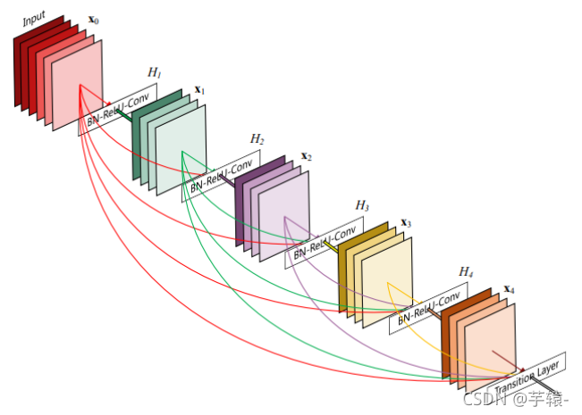
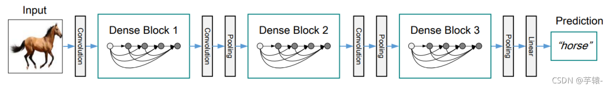

# **DenseNet**

##  简要介绍
**DenseNet**:采用密集连接机制，即互相连接所有的层，每个层都会与前面的层在channel(通道)维度上连接道一起，实现特征重用，作为下一层的输入。

这样操作的好处在于 不仅减缓了梯度消失的问题，也可使其在参数与计算量更少的情况下实现比Resnet更优的性能。


## 	网络结构
**DenseNet**网络中模块主要由 ****DenseBlock+Transition**** 组成



###  1. DenseLayer

Dense层对input进行归一化，Relu激活以及卷积后输出，为保证Dense中的稠密链接，DenseLayer使用3*3的kernel_size，并且padding为1，使input与每一次DenseLayer操作后的output进行连接
```python
class DenseLayer(nn.Module):  
    #Dense层  
    def __init__(self, in_channels, growth_rate, dropout_rate=0.0):  
        super(DenseLayer, self).__init__()  
        self.bn = nn.BatchNorm2d(in_channels)  
        #归一化  
        self.relu = nn.ReLU(inplace=True)  
        #激活  
        self.conv = nn.Conv2d(in_channels, growth_rate, kernel_size=3, padding=1, bias=False)  
        #卷积 卷积核为3*3，padding为1     
        self.dropout = nn.Dropout(dropout_rate)  
        #dropout_rate=0  不进行dropout  
  
    def forward(self, x):  
        #向前传播  
        new_features = self.conv(self.relu(self.bn(x)))  
        new_features = self.dropout(new_features)  
        return torch.cat([x,new_features],1)  
        #   返回拼接后的tensor,只进行一次卷积,拼接
```

###  2.DenseBlock
Denseblock由多个denselayer构成
假定输入层的特征层channel为k，在Densebolck中每经过一个DenseLayer，output_channel就增加k0层，最终一层Denseblock将输出的channel为==k+（L-1）k0==

```python
class DenseBlock(nn.Module):  
    def __init__(self, num_layers, in_channels, growth_rate, dropout_rate=0.0):  
        '''  
  
        :param num_layers: Dense layers层数  
        :param in_channels: 输入通道数  
        :param growth_rate: 学习率  
        :param dropout_rate: dropout参数  
  
        '''     
        super(DenseBlock, self).__init__()  
        layers = []
        
        for i in range(num_layers):  
            layers.append(DenseLayer(in_channels + i * growth_rate, growth_rate, dropout_rate))  
        self.layers = nn.ModuleList(layers)
        #初始化block 
    def forward(self, x):  
        for layer in self.layers:  
            x = layer(x)  
        return x
```
### 3.Transition
Transition用于连接相邻的两个Denseblock，并且降低特征图大小
Transition层包括一个 1 X 1 的卷积与 2 X 2 的AvgPooling的结构。

```python
class TransitionLayer(nn.Module):  
    def __init__(self, in_channels, out_channels):  
        super(TransitionLayer, self).__init__()  
        self.conv = nn.Conv2d(in_channels, out_channels, kernel_size=1, bias=False)  
        self.pool = nn.AvgPool2d(kernel_size=2, stride=2)  
  
    def forward(self, x):  
        x = self.conv(x)  
        x = F.relu(x)  
        x = self.pool(x)  
        return x
```


